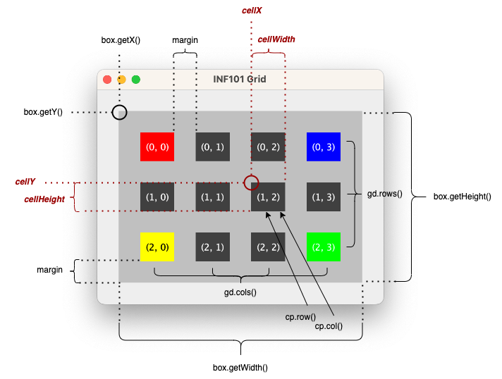

[forrige](./01-grid.md) &bullet; [oversikt](../README.md#steg-for-steg) &bullet; [neste](./03-tegnbrikke.md)

# 2 Å tegne brettet

Nå du er ferdig med dette kapittelet, skal du kunne kjøre programmet og bli vist et brett:

[](./pics/drawBoard.png)

* [Opprett en visning](#opprett-en-visning)
* [Opprett en modell](#opprett-en-modell)
* [Knyt det sammen](#knyt-det-sammen)
    * [Testing underveis](#testing-underveis)
* [Tegn brettet](#tegn-brettet)
    * [drawGame](#drawgame)
    * [drawCells](#drawcells)
    * [CellPositionToPixelConverter](#cellpositiontopixelconverter)
    * [ColorTheme](#colortheme)
* [Kodestil](#kodestil)
* [Oppdater foretrukket størrelse](#oppdater-foretrukket-størrelse-frivillig)

## Opprett en visning
Opprett en klasse `TetrisView` som utvider JPanel og opprett også et grensesnitt `ViewableTetrisModel` i pakken *no.uib.inf101.tetris.view*
- Ta utgangspunkt i klassen SampleView når du oppretter TetrisView (du kan selvfølgelig fjerne metodene paintSample og drawChess).
- La TetrisView ha en konstruktør som tar en ViewableTetrisModel som parameter. Lagre den som en instans-variabel.

For å tegne brettet trenger `TetrisView` å vite
- hvor mange rader det er på brettet
- hvor mange kolonner det er på brettet
- for hver flis, hvilken farge den skal ha

Vi må definere metoder i `ViewableTetrisModel` slik at `TetrisView` kan hente ut denne nødvendige informasjonen. Vi har i bakhodet av vi kun ønsker å ha tilgang til et minimum av nødvendig informasjon; begrens deg derfor til disse metodene i første omgang:
- en metode *getDimension* uten parametre som returnerer et `GridDimension` -objekt, og
- en metode *getTilesOnBoard* uten parametre som returnerer en `Iterable<GridCell<Character>>` som itererer over alle flisene på brettet. Mer presist, en metode som returnerer et objekt som, når det itereres over, gir alle posisjonene på brettet med tilhørende symbol.

## Opprett en modell

Alle filene i dette avsnittet hører hjemme i pakken *no.uib.inf101.tetris.model*. Du må opprette denne pakken selv. Den viktigste klassen i denne pakken er `TetrisModel`, og den skal implementerer ViewableTetrisModel. Men aller først:
- Opprett en klasse `TetrisBoard` som *utvider* Grid&lt;Character&gt;. Objekter i denne klassen representerer et tetrisbrett. Legg merke til at TetrisBoard-objekter derfor *er* et Grid&lt;Character&gt;-objekter, og arver alle metodene i Grid-klassen.
    * La konstruktøren ha to parametre: antall rader og antall kolonner på brettet.
    * La konstruktøren gjøre et kall til super-konstruktøren.
    * I konstruktøren til `TetrisBoard`, initialiser alle posisjonene i rutenettet med verdien `'-'`. Denne verdien representerer at Tetris-brettet er tomt i den gitte posisjonen.

Opprett nå `TetrisModel`, og la klassen implementere ViewableTetrisModel.
- La TetrisModel ha en instansvariabel av typen TetrisBoard.
- La konstruktøren ha en parameter av typen TetrisBoard som benyttes for å initialisere instansvariabelen.
- La TetrisModel implementere metodene fra ViewableTetrisModel. Du har tilgang til alt du trenger i instansvariabelen vi nettopp opprettet.

> Hint: når du skal implementere metoden som returnerer noe med typen `GridDimension` som inneholder antall rader og kolonner -- har du tilfeldigvis et objekt med denne typen allerede som du enkelt kan returnere? :think:

> Hint: når du skal implementere metoden som returnerer en `Iterable<CoordinateItem<Tile>>` som kan iterere over flisene på brettet -- har du tilfeldigvis et objekt med denne typen allerede som du enkelt kan returnere? :think:


## Knyt det sammen

I `TetrisMain`:
* Endre main-metoden slik at det er et `TetrisView` -objekt som vises i stedet for `SampleView`.  
  * Det er her vi må opprette et TetrisView -objekt.
  * Fordi konstruktøren til TetrisView krever å få en modell som skal tegnes som argument ved opprettelsen, må vi opprette et `TetrisModel` -objekt først (opprettes også i main-metoden).
  * Fordi TetrisModel krever å få et brett ved opprettelsen, må vi opprette et `TetrisBoard` objekt enda før det igjen.

> Et profesjonelt Tetris-brett har 20 rader og 10 kolonner; i illustrasjonene her bruker vi 15 rader.

:white_check_mark: Du skal nå kunne kjøre koden uten kompileringsfeil og vil se et tomt vindu.

#### Testing underveis

Det er lurt og ofte tidsbesparende å skrive tester for koden man skriver underveis. I så henseende gjør vi noen enkle grep.

For å støtte manuell testing:
- I main-metoden, fyll ut hjørnene på brettet med noen eksempel-verdier (gjøres før opprettelsen av TetrisModel). Dette fjerner vi senere (når spillet er helt ferdig) men er nyttig å ha når vi tester ulike deler av spillet underveis:
    * øverst til venstre (rad 0, kolonne 0): `'g'`
    * øverst til høyre (rad 0, siste kolonne): `'y'`
    * nederst til venstre (siste rad, kolonne 0): `'r'`
    * nederst til høyre (siste rad, siste kolonne): `'b'`

For å støtte automatiske tester:
- Skriv en metode `prettyString` i TetrisBoard som returnerer en `String` -representasjon av brettet på en pen måte; hver rad adskilt med linjeskift, og bokstavene i hver rad limt sammen.  
- I ***src/test*** -mappen, opprett mappen *java/no/uib/inf101/tetris/model*. Inne i denne mappen, opprett klassen `TestTetrisBoard` og legg til følgende test:

```java
@Test
public void testPrettyString() {
  TetrisBoard board = new TetrisBoard(3, 4);
  board.set(new CellPosition(0, 0), 'g');
  board.set(new CellPosition(0, 3), 'y');
  board.set(new CellPosition(2, 0), 'r');
  board.set(new CellPosition(2, 3), 'b');
  String expected = String.join("\n", new String[] {
      "g--y",
      "----",
      "r--b"
  });
  assertEquals(expected, board.prettyString());
}
```


## Tegn brettet

Vi skal nå implementere selve tegningen i `TetrisView`, altså den delen av koden som befinner seg i `paintComponent` og tilhørende hjelpemetoder. Den overordnede strukturen skal være som følger:

* `paintComponent`-metoden kaller på en hjelpemetode *drawGame*.
* `drawGame` tegner rammen rundt brettet, og oppretter et *CellPositionToPixelConverter* -objekt. Den kaller deretter på hjelpemetoden *drawCells* for å helpe til med tegningen av selve rutene.
* `drawCells` inneholder en løkke over rutene som skal tegnes. For hver rute kaller den hjelpemetoden *getBoundsForCell* for å få vite hvor ruten skal tegnes, og hjelpemetoden *getCellColor* for å finne ut hvilken farge ruten skal tegnes med. Så tegnes ruten på lerretet.
* `getBoundsForCell`-metoden hører til et *CellPositionToPixelConverter* -objekt, og regner ut piksel-koordinatene til en rute basert på en dens posisjon (radnummer og kolonnenummer) i rutenettet.
* `getCellColor`-metoden hører til et *ColorTheme* -objekt, og returnerer et `java.awt.Color` -objekt basert på en *char*.

> Måten vi tenker på når vi skal utvikle og forstå helheten i et program er «top-down» -- man begynner med å dele opp oppgaven i store steg, og så drømmer vi opp hjelpemetoder vi trenger før disse hjelpemetodene faktisk eksisterer. Når vi skriver kode, er det ofte lettere å gjøre det «bottom up», slik at vi kan teste hver enkelt byggeklosse/metode mens vi holder på. Dette for å si: i hvilken rekkefølge du løser resten av oppgaven er opp til deg. **Det kan være lettest å begynne nederst med ColorTheme og jobbe deg baklengs opp hit igjen når du koder.**


### drawGame

**Parametre**
 * en `Graphics2D` -variabel for lerretet det skal tegnes på.
 
Metoden er ikke-static, og har derfor tilgang til alle instansvariabler.

**Hensikt** 
Å tegne selve spill-elementene i Tetris.

**Pseudokode**
* Opprett et rektangel-objekt med fast avstand til kantene på lerretet (se eksempel i kursnotater om grafikk).
* Fyll dette rektangelet med fargen som tilhører rammen rundt rutenettet (farge hentes fra instansvariabel med fargetema, se ColorTheme).
* Opprett et *CellPositionToPixelConverter* -objekt basert på samme rektangel. I eksempelillustrasjonen vår bruker vi en rammetykkelse (margin) på 2 piksler.
* Tegn selve rutene ved å kalle på drawCells


### drawCells

**Parametre**
* en `Graphics2D` -variabel for lerretet det skal tegnes på,
* en `Iterable<GridCell<Character>>` for samlingen av ruter som skal tegnes,
* en `CellPositionToPixelConverter` -variabel for å oversette fra posisjon i rutenettet til et rektangelobjekt, samt
* en `ColorTheme` -variabel for å bestemme fargene.

Med disse parametrene har ikke metoden behov for tilgang til instansvariabler, og metoden bør derfor være static.

**Hensikt**
å tegne en samling med ruter, for eksempel rutene på Tetris-brettet.

**Pseudokode**
For hver rute i samlingen:
* Benytt *getBoundsForCell* -metoden på *CellPositionToPixelConverter* -objektet for å få tak i rektangelet som skal tegnes.
* Benytt *getCellColor* -metoden på `ColorTheme` -objektet for å få tak i fargen det skal fylles med
* Fyll rektangelet med fargen på lerretet

### CellPositionToPixelConverter

> PS: denne klassen er identisk til lab4, du kan kopiere koden din derfra

Vi ønsker å opprette en hjelpemetode `getBoundsForCell` som oversetter koordinater i rutenettet til et rektangel med posisjon og størrelse beskrevet som piksler til bruk på et lerret. Det er naturlig at denne metoden
* har en parameter av typen `CellPosition` og 
* returnerer et `Rectangle2D` -objekt.

Men -- dette er ikke tilstrekkelig informasjon for å gjøre utregningen; vi trenger i tillegg å vite
* innefor hvilket område rutenettet skal tegnes
* hvor mange rader og kolonner det er i rutenettet som helhet, og
* hvor stor avstanden mellom rutene (marginen) skal være.

Disse siste delene med informasjon vil ikke endre seg særlig fra kall til kall, men er en del av *konteksten* metoden kjører i. Slik kontekst er best beskrevet som instansvariabler.

I klassen `CellPositionToPixelConverter`:

* Opprett instansvariabler:
  * En `Rectangle2D` -variabel `box` som beskriver innenfor hvilket område rutenettet skal tegnes
  * En `GridDimension` -variabel `gd` som beskriver størrelsen til rutenettet rutene vil være en del av
  * En `double` kalt `margin` som beskriver hvor stor avstanden skal være mellom rutene
* Opprett en konstruktør i klassen med tre parametre: en `Rectangle2D` -variabel, en `GridDimension` -variabel og en `double`. Initaliser feltvariablene med argumentene som mottas i konstruktøren.
* Opprett metoden `getBoundsForCell` med en parameter av typen `CellPosition` (i figur under navgitt `cp`) og returtype `Rectangle2D`.

Returverdien er et `Rectangle2D` -objekt. For å opprette dette objektet, må du regne ut fire verdier: x, y, bredde og høyde for den gitte ruten. Så kan du returnere et nytt `Rectangle2D.Double` -objekt med disse verdiene.

Illustrasjonen under visualiserer input-variablene og resultatvariablene. Variabler i svart tekst er tilgjengelig input via parametre eller som instansvariabler, mens variablene i rød kursiv tekst er de du skal regne ut og returnere i form av et rektangel-objekt.



Hint:
* Benytt `double` hvis du gjør regnestykker som involverer divisjon, da unngår du avrundingsfeil.
* Ikke bland horisontale og vertikale verdier. Horsiontale begreper: x, bredde, kolonne. Vertikale begreper: y, høyde, rad.
* Begynn med å regne ut *cellWidth* og *cellHeight*, og bruk verdiene du finner der for videre kalkulasjoner.

> Eksempel: anta at du får følgende parametre (som i illustrasjonen):
>  * `box.getX()` er 29 og `box.getY()` er 29
>  * `box.getWidth()` er 340 og `box.getHeight()` er 240
>  * `cp.col()` er 2 og `cp.row()` er 1
>  * `gd.cols()` er 4 og `gd.rows()` er 3
>  * `margin` er 30
>
> Vi begynner med å regne ut `cellWidth`. Siden vi har 4 kolonner totalt, vil det gå med 5*30=150 piksler til marginer, og vi får da 190 piksler igjen å fordele på de fire kolonnene. Vi får da at cellen skal ha bredde 47.5.
>
> For å finne verdien til `cellX` begynner vi på posisjonen `box.getX()` og går derfra videre mot høyre ved å plusse på margin + rutebredde + margin + rutebredde + margin. Verdien blir da 29+30+47.5+30+47.5+30 = 214.
>
> Tilsvarende finner vi at `cellHeight` blir 40 og `cellY` blir 129.


For å teste CellPositionToPixelConverter:
* Opprett en fil `TestCellPositionToPixelConverter` i test-hierarkiet i samme pakke (*no.uib.inf101.tetris.view*) og legg til følgende test:

```java
@Test
public void sanityTest() {
  GridDimension gd = new TetrisBoard(3, 4);
  CellPositionToPixelConverter converter = new CellPositionToPixelConverter(
      new Rectangle2D.Double(29, 29, 340, 240), gd, 30
  );
  Rectangle2D expected = new Rectangle2D.Double(214, 129, 47.5, 40);
  assertEquals(expected, converter.getBoundsForCell(new CellPosition(1, 2)));
}
```


### ColorTheme

Et *fargetema* er den delen av programmet som oversetter informasjon i modellen til en farge som vises for brukeren. For å gjøre det enkelt å bytte ut fargetema, lar vi `ColorTheme` være et grensesnitt, mens `DefaultColorTheme` er en klasse som implementerer grensesnittet.

Opprett et grensesnitt `ColorTheme` i pakken *no.uib.inf101.tetris.view* med følgende metoder:
* `getCellColor` med en parameter av typen *char* og returverdi av typen `Color` (klassen Color importeres fra *java.awt*). Returverdi kan ikke være `null`, ellers får du merkelige bugs.
* `getFrameColor` uten parametre med returverdi av typen `Color`. Returverdi bør ikke være `null`, men det er mulig å benytte en helt gjennomsiktig farge (`new Color(0, 0, 0, 0)`) hvis man ikke ønsker å ha en egen ramme rundt rutene.
* `getBackgroundColor` uten parametre med returverdi av typen `Color` (PS! denne fargen kan *ikke* være gjennomsiktig -- men den *kan* være `null` dersom du ønsker å benytte standard bakgrunnsfarge fra Java)

Opprett også en klasse `DefaultColorTheme` som implementerer `ColorTheme`. Du kan velge hvordan du vil implementere metodene helt selv, men sørg for at ulike `char` -verdier gir ulike farger.

> Tips: benytt et `switch` -uttrykk:
> ```java
> @Override
> public Color getCellColor(Character c) {
>   Color color = switch(c) {
>     case 'r' -> Color.RED;
>     case 'g' -> Color.GREEN;
>     // .... fyll ut dine favorittfarger
>     case '-' -> Color.BLACK;
>     default -> throw new IllegalArgumentException(
>         "No available color for '" + c + "'");
>   };
>   return color;
> }
> ```
> Se [kursnotatene om farger](https://inf101.ii.uib.no/notat/grafikk/#farger) for å se hvordan du kan velge dine favoritt-farger. Du trenger å definere en farge for alle *char* -verdier som potensielt kan dukke opp i programmet. Du kan legge til flere etter hvert ved behov. Tips: krasj programmet dersom du ikke har definert en farge, da unngår du en del potensielt merkelige bugs hvis du senere glemmer å definere en farge for et symbol.

For å benytte fargetemaet, gjør følgende grep i `TetrisView`:
* opprett en instansvariabel av typen `ColorTheme`,
* initialiser variabelen i konstruktøren med et nytt `DefaultColorTheme` -objekt, og
* (fremdeles i konstruktøren) hent bakgrunsfargen fra fargetema-objektet og bruk den som argument til et kall på `this.setBackground` -metoden som TetrisView har arvet fra JPanel.

For å teste fargetemaet:
* Opprett en fil `TestDefaultColorTheme` i test-hierarkiet i samme pakke (*no.uib.inf101.tetris.view*) og legg til følgende test (bytt ut med de fargene du forventer med ditt fargetema):

```java
@Test
public void sanityTestDefaultColorTheme() {
  ColorTheme colors = new DefaultColorTheme();
  assertEquals(null, colors.getBackgroundColor());
  assertEquals(new Color(0, 0, 0, 0), colors.getFrameColor());
  assertEquals(Color.BLACK, colors.getCellColor('-'));
  assertEquals(Color.RED, colors.getCellColor('r'));
  assertThrows(IllegalArgumentException.class, () -> colors.getCellColor('\n'));
}
```

## Kodestil

Se over koden din, og dobbeltsjekk at du har god kodestil.
* Unngå *magiske tall* i koden -- alle magiske tall skal være definert som en navngitt konstant (for eksempel `INNER_MARGIN` og `OUTER_MARGIN`)
* Tenk på innkapsling. Bruk heller `private` enn `public` med mindre du har en god grunn til å gjøre noe annet.
* Ha gode og selvbeskrivende variabelnavn. Det er bedre med et variabelnavn som er langt og beskrivende enn kort og uforståelig (selv om kort og selvbeskrivende er aller best). Dette gjelder spesielt feltvariabler og parametre.
* Alle metoder i grensesnitt bør ha gode og presise javadoc -kommentarer.
* Alle metoder som er public og som ikke har `@Override` bør ha gode og presise javadoc -kommentarer.
* Begrens antall tegn per linje. I Java er man litt mer generøse med hvor lange linjene kan være enn i for eksempel Python, men hold deg likevel til følgende:
    * Javadoc-kommentarer skal ikke gå forbi 72 tegn i bredden.
    * Andre kommentarer skal ikke gå forbi 80 tegn.
    * Unntak for kommentarer med lange nettadresser, de må være så lange som de er.
    * Kodelinjer skal *helst* være under 80 tegn, men det er ikke et absolutt krav.
    * Kodelinjer skal aldri ha mer enn 120 tegn på én linje.
* Begrens antall linjer per metode
    * Hvis du har mer enn 25 kodelinjer i samme metode bør du vurdere om det hadde vært bedre å dele opp metoden i hjelpemetoder. Unntak for spesielt oversiktelige sekvenser f. eks. ved bruk av `switch`.
* Skriv tester underveis der du ser det er mulig. De testene vi oppgir i oppgaveteksten er bare et minimum; det skader nesten aldri å legge til litt flere tester.


## Oppdater foretrukket størrelse (frivillig)

For å få et pent spill med Tetris, kan vi regne ut hvor stort vi ønsker at vinduet vårt skal være når vinduet åpnes. Dersom du foretrekker at rutene har størrelse *s* i høyde- og bredde-retning med en avstand/margin på *m*, blir regnestykket noe sånt som
- ønsket bredde = (s + m) * antall kolonner + m + eventuell ekstra margin ytterst rundt brettet.
- ønsket høyde = (s + m) * antall rader + m + eventuell ekstra margin ytterst rundt brettet.

Når du kaller setPreferredSize i konstruktøren til TetrisView, kan du benytte slike utregnede verdier for høyde og bredde.

---

:white_check_mark: Du er klar for neste kapittel når du kan kjøre TetrisMain og et Tetris-brett vises med en farge i hvert av hjørnene. Du skal kunne endre størrelse på vinduet, og brettet skal da tilpasse seg den nye størrelsen.
