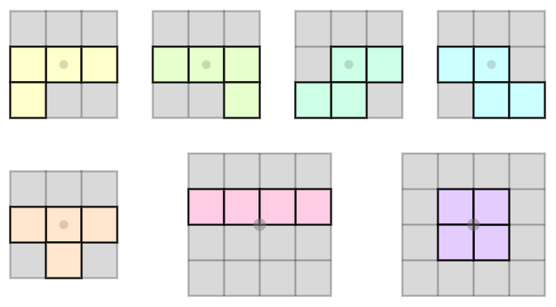
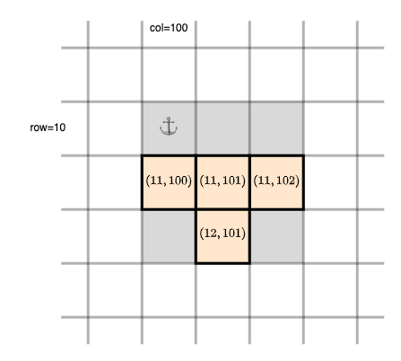

[forrige](./02-tegnrutenett.md) &bullet; [oversikt](../README.md#steg-for-steg) &bullet; [neste](./04-flyttebrikke.md)

# 3 Tegne brikken

Når du er ferdig med dette kapittelet, skal du kunne kjøre programmet og se en såkalt *tetromino* øverst på brettet.

[](./pics/drawBoardWithPiece.png)

I Tetris finnes det 7 ulike familier en tetromino kan tilhøre:



De ulike familiene kalles (oppe fra venstre) L, J, S, Z (nede fra venstre) T, I og O.


Før tetromino-brikken kan tegnes, må vi opprette en struktur i modellen vår for å representere en fallende tetromino.

* [Modellen](#modellen)
  * [Tetromino](#tetromino)
    * [Konstruksjon av tetromino-objekter](#konstruksjon-av-tetromino-objekter)
    * [Flytting av tetromino-objekter](#flytting-av-tetromino-objekter)
    * [Tetromino skal være iterable](#tetromino-skal-være-iterable)
    * [Tetromino skal kunne sammenlignes](#tetromino-skal-kunne-sammenlignes)
    * [TestTetromino](#testtetromino)
  * [TetrominoFactory](#tetrominofactory)
  * [RandomTetrominoFactory](#randomtetrominofactory)
  * [TetrisModel](#tetrismodel)
* [Visningen](#visningen)
* [Testing](#testing)
  * [PatternedTetrominoFactory](#patternedtetrominofactory)
  * [TestTetrisModel](#testtetrismodel)

## Modellen

I modellen oppretter vi en pakke _no.uib.inf101.tetris.model.**tetromino**_. I denne pakken skal vi opprette et grensesnitt `TetrominoFactory` og to klasser: `Tetromino` og `RandomTetrominoFactory`.

### Tetromino
Opprett en klasse `Tetromino` som representerer en tetromino. Denne klassen skal være uforanderlig, det vil si at når et objekt først er opprettet skal det ikke kunne muteres.

> En tetromino har tre egenskaper:
> * et symbol som representer familen brikken tilhører: for eksempel `'T'`-familien, `'I'`-familien, `'S'`-familien, etc. Dette bestemmer hvilken farge tetrominoen skal tegnes med.
> * en fasong; for eksempel en stående T, eller T som er sidelengs, eller en T som er opp ned, eller en stående I, eller en liggende I etc.
> * en posisjon på brettet
>
> Internt i klassen representerer vi «fasong» som en to-dimensjonal array av boolean. For eksempel kan en stående T-brikke representeres ved dette kvadratiske arryet:
> ```java
> new boolean[][] {
>     { false, false, false },
>     {  true,  true,  true },
>     { false,  true, false }
> }
> ```

#### Konstruksjon av Tetromino-objekter

- La konstruktøren til `Tetromino` ta som parametre
  - en `char` som representerer symbolet til brikken,
  - en `boolean[][]` som representerer fasongen til brikken, og
  - en `CellPosition` som representerer posisjonen til hjørnet øverst til venstre på brikken (denne posisjonen er ikke faktisk en del av tetrominoen dersom hjørnet oppe til venstre i fasongen er `false`, men beskriver hvor på spillebrettet «fasongen er festet»).

Lagre argumentene til konstruktøren i instansvariabler.

Vi ønsker ikke at det skal være mulig å konstruere hvilke som helst Tetromino-objekter; kun de 7 som er vis i illustrasjonen. Så istedet for at konstruktøren til `Tetromino` er `public`, gjør vi den stedet `private`. Konstruksjon av nye objekter på forespørsel av kode i andre klasser gjør vi i stedet via en static klassemetode:

- Opprett en pakke-privat klassemetode `newTetromino` som har en *char* som parameter, og som returnerer et nytt *Tetromino*-objekt med fasong basert på symbolet som blir gitt.
  * Pass på at fasongen blir én av de 7 vist i illustrasjonene over.
  * Posisjonen skal være (0, 0). 
  * Hvis det kommer et ukjent symbol, kast IllegalArgumentException.

> Vi gjør rotasjon og posisjonering en del enklere for oss selv hvis alle brikkene er representert med en *kvadratisk* 2D-array (like mange rader som kolonner), og hvis alle brikken vi lager alltid har én «tom» rad øverst (med kun `false`) når den blir opprettet i `newTetromino`.


#### Flytting av Tetromino-objekter

Slik vi skrev *newTetromino*-metoden, vil alle opprettede Tetromino-objekter ha plasseringen (0, 0). Vi trenger en måte å lage tetrominoer med andre plasseringer. Vi kunne for eksempel hatt en metode som endret på tetromino'en sin posisjon, men vi fordi Tetromino -klassen skal være uforanderlig løser vi det i stedet med en metode som kan lage en flyttet kopi av seg selv:

* Opprett en metode `shiftedBy` som har to *int* som parametre (deltaRow og deltaCol) som indikerer hvor langt kopien skal være flyttet i forhold til nåværende plassering. La metoden opprette en kopi av seg selv, bortsett fra at posisjonen er flyttet.

- Opprett også en metode `shiftedToTopCenterOf` som har en parameter av typen *GridDimension*. La metoden opprette en flyttet kopi som er sentrert rundt midterste eller de to midterste kolonnene i et rutenett med de gitte dimensjonene, og som er slik at øverste reelle rute i brikken kommer på rad 0.


#### Tetromino skal være iterable

For at en bruker av et Tetromino -objekt skal få vite noe om tetrominoen, lar vi `Tetromino` implementere grensesnittet `Iterable<GridCell<Character>>`. Implementer iterator-metoden slik at den itererer over kun de reelle posisjonene tetrominoen dekker.


> Tips til implementasjon av iterator-metoden: opprett en liste som skal inneholde `GridCell<Character>` -objekter. Benytt en dobbel for-løkke for å gå gjennom alle posisjoner i fasongen -- dersom fasongen er `true` på en posisjon, regn ut hvilken posisjon dette tilsvarer på brettet og legg til et nytt GridCell-objekt i listen. Til slutt, gjør et kall til `.iterator` på listen og returner resultatet.

#### Tetromino skal kunne sammenlignes

Implementer hashCode og equals.

> Husk å benytte *Arrays.deepEquals* når du sammenligner fasongene, og benytt *Arrays.deepHashCode* for å regne ut hashCode for fasongene. For eksempel, for å regne ut hashCode: `Objects.hash(this.symbol, Arrays.deepHashCode(this.shape), this.pos)`


#### TestTetromino

For å teste at Tetromino -klassen fungerer: opprett `TestTetromino` i test-hierarkiet, i *samme* pakke som `Tetromino` (altså i pakken *no.uib.inf101.tetris.model.tetromino*) og legg til testene:
```java
@Test
public void testHashCodeAndEquals() {
  Tetromino t1 = Tetromino.newTetromino('T');
  Tetromino t2 = Tetromino.newTetromino('T');
  Tetromino t3 = Tetromino.newTetromino('T').shiftedBy(1, 0);
  Tetromino s1 = Tetromino.newTetromino('S');
  Tetromino s2 = Tetromino.newTetromino('S').shiftedBy(0, 0);

  assertEquals(t1, t2);
  assertEquals(s1, s2);
  assertEquals(t1.hashCode(), t2.hashCode());
  assertEquals(s1.hashCode(), s2.hashCode());
  assertNotEquals(t1, t3);
  assertNotEquals(t1, s1);
}
```

```java
@Test
public void tetrominoIterationOfT() {
  // Create a standard 'T' tetromino placed at (10, 100) to test
  Tetromino tetro = Tetromino.newTetromino('T');
  tetro = tetro.shiftedBy(10, 100);

  // Collect which objects are iterated through
  List<GridCell<Character>> objs = new ArrayList<>();
  for (GridCell<Character> gc : tetro) {
    objs.add(gc);
  }

  // Check that we got the expected GridCell objects
  assertEquals(4, objs.size());
  assertTrue(objs.contains(new GridCell<>(new CellPosition(11, 100), 'T')));
  assertTrue(objs.contains(new GridCell<>(new CellPosition(11, 101), 'T')));
  assertTrue(objs.contains(new GridCell<>(new CellPosition(11, 102), 'T')));
  assertTrue(objs.contains(new GridCell<>(new CellPosition(12, 101), 'T')));
}
```


Illustrasjon av test-casen over

* Opprett din egen test `tetrominoIterationOfS` som gjør samme testen som over, men for en standard tetromino i S-familien
* Opprett din egen test for å sjekke at hvis du flytter brikken to ganger like langt så vil du ha flyttet dobbelt så langt som hvis du flyttet brikken én gang.
* Opprett din egen test for å sjekke at *shiftedToTopCenterOf* fungerer. Sjekk spesielt at den fungerer både for 4x4 tetromino'er når det er et partall antall kolonner, og for en 3x3 tetromino for et oddetall antall kolonner. I de andre tilfellene er det umulig å treffe midt på, og det er da det samme hvilken vei du runder av.


### TetrominoFactory

Opprett et grensesnitt `TetrominoFactory` i samme pakke som *Tetromino*-klassen. La grensesnittet definere en metode *getNext* uten parametre som returnerer en *Tetromino*.

### RandomTetrominoFactory

Opprett en klasse `RandomTetrominoFactory` i samme pakke som *Tetromino* som implementerer `TetrominoFactory`. I *getNext*-metoden, velg et tilfeldig tegn i `"LJSZTIO"` og kall *newTetromino* på Tetromino-klassen. Returner resultatet.


### TetrisModel

I `TetrisModel`:
- La det finnes en instansvariabel av typen *TetrominoFactor* og la konstruktøren ha en matchende parameter som benyttes for å initialisere den
- La det finnes en instansvariabel av typen *Tetromino* som representerer en fallende brikke. I konstruktøren, gjør et kall til *getNext* på teromino-fabrikken for å få en tetromino, og kall *shiftedToTopCenterOf*-metoden på denne brikken når du initialiserer instansvariabelen.
- Implementer metoden som kreves av ViewableTetrisModel (se under)

I `TetrisMain`:
- Opprett et nytt *TetrominoFactory*-objekt i *TetrisMain* du  gir som argument når du oppretter *TetrisModel*-objektet.


## Visningen

Planen er å la TetrisView tegne den fallende brikken "over" brettet.

- Definer en ny metode i `ViewableTetrisModel` som tilgjengeliggjør rutene til den fallende brikken på *nøyaktig samme måte* som vi gjorde det for brettet (med andre ord, la returtypen være `Iterable<GridCell<Character>>`)
- Modifiser drawGame -metoden slik at den fallende brikken tegnes «oppå» brettet vi allerede har tegnet (hint: du trenger bare én ny linje kode i hele TetrisView).

---

:white_check_mark:  Når du er ferdig frem til hit, skal du kunne kjøre programmet og en «fallende» tetromino vil vises (dog ikke falle).

---

## Testing

Tiden er snart inne for å skrive vår første test for selve TetrisModel. Men først litt tilrettelegging:


### PatternedTetrominoFactory

I *test*-hierarkiet, opprett en klasse `PatternedTetrominoFactory` i pakken *no.uib.inf101.tetris.model.tetromino* som implementerer `TetrominoFactory`. La konstruktøren ta inn en streng du lagrer som en feltvariabel. Hver gang *getNext*-metoden kalles, velg det neste tegnet i strengen og kall *newTetromino* på Tetromino-klassen (benytt gjerne flere instansvariabler for å hjelpe holde styr på hvor langt du har kommet). Returner resultatet. Når du er ferdig med alle symbolene i strengen, begynner du på nytt på begynnelsen av strengen igjen.

**Testing**

Opprett filen `TestPatternedTetrominoFactory` og legg til testen:
```java
@Test
public void sanityTestPatternedTetrominoFactory() {
  TetrominoFactory factory = new PatternedTetrominoFactory("TSZ");

  assertEquals(Tetromino.newTetromino('T'), factory.getNext());
  assertEquals(Tetromino.newTetromino('S'), factory.getNext());
  assertEquals(Tetromino.newTetromino('Z'), factory.getNext());
  assertEquals(Tetromino.newTetromino('T'), factory.getNext());
  assertEquals(Tetromino.newTetromino('S'), factory.getNext());
}
```

### TestTetrisModel

Opprett klassen `TestTetrisModel` i pakken *no.uib.inf101.tetris.model* og legg til følgende test (men tilpasset til dine parametre og metodenavn):

```java
@Test
public void initialPositionOfO() {
  TetrominoFactory factory = new PatternedTetrominoFactory("O");
  ViewableTetrisModel model = new TetrisModel(20, 10, factory);

  List<GridCell<Character>> tetroCells = new ArrayList<>();
  for (GridCell<Character> gc : model.fallingTetromino()) {
    tetroCells.add(gc);
  }

  assertEquals(4, tetroCells.size());
  assertTrue(tetroCells.contains(new GridCell<>(new CellPosition(0, 4), 'O')));
  assertTrue(tetroCells.contains(new GridCell<>(new CellPosition(0, 5), 'O')));
  assertTrue(tetroCells.contains(new GridCell<>(new CellPosition(1, 4), 'O')));
  assertTrue(tetroCells.contains(new GridCell<>(new CellPosition(1, 5), 'O')));
}
```


